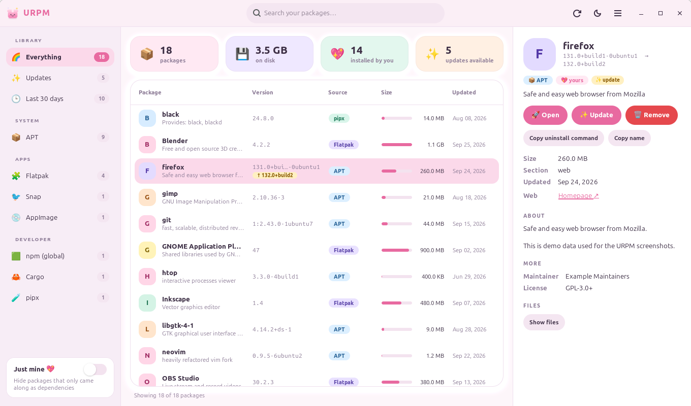
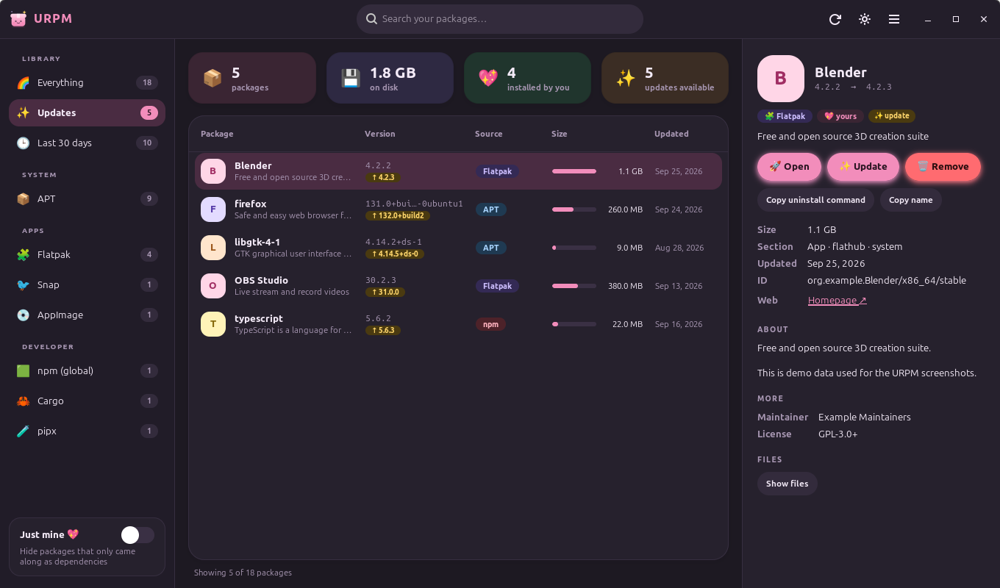
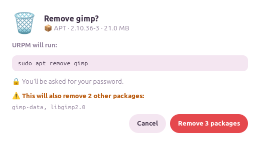

<div align="center">


# URPM

**Every package on your Linux machine, in one cute little window.**

APT · DNF · pacman · Flatpak · Snap · AppImage · Homebrew · Nix · pip · npm · Cargo · and more

[](https://github.com/MrNaji1/URPM/actions/workflows/ci.yml)
[](https://github.com/MrNaji1/URPM/releases/latest)
[](LICENSE)



</div>

## What is URPM for?

Linux machines collect software from lots of places. There's your distro's package manager,
plus Flatpak and Snap apps, AppImages sitting in `~/Downloads`, Python tools from pip,
global npm packages, Rust tools from Cargo… Each one has its own commands, and none of them
can show you the whole picture.

**URPM puts it all in one place.** Open it and you can instantly answer questions like:

- 🤔 *"What have I actually installed on this computer?"* Flip on **Just mine** to hide
  the thousands of libraries that came along as dependencies.
- 💾 *"What's eating my disk?"* Sort by size across every package manager at once.
- ✨ *"What needs updating?"* One view shows updates from APT, Flatpak, Snap, npm and more.
- 🕒 *"What changed recently?"* That's handy when something broke after an install.
- 🧹 *"How do I get rid of this?"* Remove it right there, after URPM shows you exactly
  what else would be removed.
- 📋 *"What do I need to set up my new laptop?"* Export your list to CSV, JSON or text.

## Features

| | |
|---|---|
| 🌈 **One list for everything** | 16 package managers, detected automatically. No setup. |
| 🔍 **Instant search** | Just start typing. Searches names, IDs and descriptions. |
| 💖 **Just mine** | Hides packages that were only pulled in as dependencies. |
| ✨ **Update checker** | Finds updates across all your package managers in the background. |
| 🚀 **Open apps** | Launch Flatpaks, Snaps, AppImages and desktop apps from their page. |
| 🗑️ **Safe removal** | Previews everything that would be removed *before* you confirm, then asks for your password through polkit. |
| 📂 **File lists** | See which files a package put on your system. |
| 📊 **Stats** | Package count, disk usage, how many you installed, and pending updates. |
| 📤 **Export** | Save the current view as CSV, JSON or plain text. |
| 🌙 **Light and dark** | Follows your system theme and remembers your choice. |
| ⌨️ **Keyboard friendly** | `Ctrl+F` search, `Ctrl+R` reload, `Ctrl+U` updates, `Ctrl+E` export. |

<div align="center">

<br><br>

</div>

## Supported package managers

URPM checks which of these you have and shows only those. Missing a package manager is
never an error.

### 🖥️ Distro package managers

| Package manager | Distros | List | Update check | Remove | Update | Files |
|---|---|:-:|:-:|:-:|:-:|:-:|
| 📦 **APT / dpkg** (`.deb`) | Debian, Ubuntu, Linux Mint, Pop!_OS, elementary OS, Zorin, Kali, Raspberry Pi OS, MX Linux | ✅ | ✅ | ✅ | ✅ | ✅ |
| 🎩 **RPM** + DNF / Zypper / YUM (`.rpm`) | Fedora, RHEL, Rocky, AlmaLinux, CentOS Stream, openSUSE, Nobara, Mageia | ✅ | ✅ | ✅ | ✅ | ✅ |
| 👾 **pacman** | Arch, Manjaro, EndeavourOS, CachyOS, Garuda, SteamOS | ✅ | ✅¹ | ✅ | — ² | ✅ |
| 🌀 **XBPS** | Void Linux | ✅ | ✅ | ✅ | ✅ | ✅ |
| 🏔️ **apk** | Alpine Linux, postmarketOS | ✅ | ✅ | ✅ | ✅ | ✅ |
| 🐮 **Portage** | Gentoo, Funtoo, Calculate | ✅ | — | ✅ | — | ✅ |
| ☀️ **eopkg** | Solus | ✅ | ✅ | ✅ | ✅ | ✅ |

### 📱 Universal app formats

| Package manager | List | Update check | Remove | Update | Open | Files |
|---|:-:|:-:|:-:|:-:|:-:|:-:|
| 🧩 **Flatpak** (apps + runtimes, system + user) | ✅ | ✅ | ✅ | ✅ | ✅ | ✅ |
| 🐦 **Snap** | ✅ | ✅ | ✅ | ✅ | ✅ | — |
| 💿 **AppImage**³ | ✅ | — | ✅ (to trash) | — | ✅ | ✅ |
| ❄️ **Nix** (`nix-env` and `nix profile`) | ✅ | — | ✅ | — | — | — |
| 🍺 **Homebrew** on Linux | ✅ | ✅ | ✅ | ✅ | — | ✅ |

### 🛠️ Developer tools

| Package manager | List | Update check | Remove | Update | Files |
|---|:-:|:-:|:-:|:-:|:-:|
| 🐍 **pip** (`--user` installs) | ✅ | ✅ | ✅ | ✅ | ✅ |
| 🧪 **pipx** | ✅ | — | ✅ | — | — |
| 🟩 **npm** (global `-g` packages) | ✅ | ✅ | ✅ | ✅ | ✅ |
| 🦀 **Cargo** (`cargo install`) | ✅ | — | ✅ | — | ✅ |

<sub>¹ Needs `checkupdates` from `pacman-contrib`, which checks safely without touching your
real package database. ² Arch doesn't support upgrading a single package (partial upgrades),
so URPM shows the update and leaves `sudo pacman -Syu` to you. ³ URPM looks in
`~/Applications`, `~/Downloads`, `~/Desktop`, `~/.local/bin`, `~/AppImages`, `~/bin`,
`/opt` and `/usr/local/bin`.</sub>

Want another one (Guix, Conda, RubyGems, Go…)?
[Open an issue](https://github.com/MrNaji1/URPM/issues/new?template=package_manager.md).
Adding one is usually about 50 lines of code.

## Installation

URPM needs **Python 3.10+** and **GTK 4** with its Python bindings (PyGObject). Most
desktops already have them. To remove or update packages from inside the app, you also
need **polkit** (`pkexec`), which almost every desktop ships.

### ⚡ Quick install (any distro)

```bash
curl -fsSL https://raw.githubusercontent.com/MrNaji1/URPM/main/install.sh | bash
```

This installs URPM for your user only, so it needs no root. If GTK 4 bindings are
missing, it detects your distro and **asks before** installing them with `sudo`. Afterwards,
find **URPM** in your app menu or run `urpm`.

Prefer to look before you run? Clone it instead:

```bash
git clone https://github.com/MrNaji1/URPM.git
cd URPM
./install.sh
```

To uninstall: `./install.sh --uninstall`

### 📦 Distro-specific instructions

<details open>
<summary><b>Debian · Ubuntu · Linux Mint · Pop!_OS · elementary · Zorin</b></summary>

Download the `.deb` from the [latest release](https://github.com/MrNaji1/URPM/releases/latest)
and install it. APT pulls in the dependencies for you:

```bash
sudo apt install ./urpm_*_all.deb
```

Or install the dependencies and use the quick installer:

```bash
sudo apt install python3-gi gir1.2-gtk-4.0 pkexec
curl -fsSL https://raw.githubusercontent.com/MrNaji1/URPM/main/install.sh | bash
```

Works on Ubuntu 22.04+, Debian 12+ and Mint 21+.
</details>

<details>
<summary><b>Fedora · RHEL · Rocky · AlmaLinux · CentOS Stream</b></summary>

```bash
sudo dnf install python3-gobject gtk4 polkit
curl -fsSL https://raw.githubusercontent.com/MrNaji1/URPM/main/install.sh | bash
```

To build a proper RPM, use the spec file in [`packaging/rpm/`](packaging/rpm/urpm.spec):

```bash
sudo dnf install rpm-build rpmdevtools
spectool -g -R packaging/rpm/urpm.spec
rpmbuild -ba packaging/rpm/urpm.spec
sudo dnf install ~/rpmbuild/RPMS/noarch/urpm-*.rpm
```
</details>

<details>
<summary><b>openSUSE Tumbleweed · Leap</b></summary>

```bash
sudo zypper install python3-gobject python3-gobject-Gdk typelib-1_0-Gtk-4_0 polkit
curl -fsSL https://raw.githubusercontent.com/MrNaji1/URPM/main/install.sh | bash
```
</details>

<details>
<summary><b>Arch · Manjaro · EndeavourOS · CachyOS · Garuda</b></summary>

Build the package with the included [`PKGBUILD`](packaging/arch/PKGBUILD):

```bash
git clone https://github.com/MrNaji1/URPM.git
cd URPM/packaging/arch
makepkg -si
```

Or use the quick installer:

```bash
sudo pacman -S --needed python-gobject gtk4 polkit pacman-contrib
curl -fsSL https://raw.githubusercontent.com/MrNaji1/URPM/main/install.sh | bash
```

`pacman-contrib` is optional; it lets URPM show pending pacman updates.
</details>

<details>
<summary><b>Void Linux</b></summary>

```bash
sudo xbps-install -S python3-gobject gtk4 polkit
curl -fsSL https://raw.githubusercontent.com/MrNaji1/URPM/main/install.sh | bash
```
</details>

<details>
<summary><b>Alpine Linux · postmarketOS</b></summary>

```bash
sudo apk add python3 py3-gobject3 gtk4.0 polkit bash curl
curl -fsSL https://raw.githubusercontent.com/MrNaji1/URPM/main/install.sh | bash
```
</details>

<details>
<summary><b>Gentoo</b></summary>

```bash
sudo emerge --ask dev-python/pygobject gui-libs/gtk sys-auth/polkit
curl -fsSL https://raw.githubusercontent.com/MrNaji1/URPM/main/install.sh | bash
```
</details>

<details>
<summary><b>Solus</b></summary>

```bash
sudo eopkg install python-gobject libgtk-4 polkit
curl -fsSL https://raw.githubusercontent.com/MrNaji1/URPM/main/install.sh | bash
```
</details>

<details>
<summary><b>NixOS</b></summary>

Run it straight from a clone with the dependencies in a temporary shell:

```bash
git clone https://github.com/MrNaji1/URPM.git && cd URPM
nix-shell -p 'python3.withPackages (p: [ p.pygobject3 ])' gtk4 gobject-introspection \
  --run 'python3 -m urpm'
```
</details>

<details>
<summary><b>pipx / pip (any distro)</b></summary>

Install the GTK 4 bindings from your distro first (see above). Then install URPM with
`--system-site-packages` so it can see them:

```bash
pipx install --system-site-packages git+https://github.com/MrNaji1/URPM.git
urpm --install-desktop    # adds URPM to your app menu
```
</details>

<details>
<summary><b>System-wide from source (for packagers)</b></summary>

```bash
sudo make install                        # installs to /usr/local
sudo make install PREFIX=/usr            # or /usr
make install DESTDIR=/tmp/pkg PREFIX=/usr   # staged, for building packages
sudo make uninstall
make deb                                 # builds dist/urpm_<version>_all.deb
```
</details>

<details>
<summary><b>Run without installing</b></summary>

```bash
git clone https://github.com/MrNaji1/URPM.git && cd URPM
python3 -m urpm
```
</details>

## Using URPM

- **Pick a view** in the sidebar: *Everything*, *Updates*, *Last 30 days*, or a single
  package manager.
- **Search** by typing anywhere. `Esc` clears it.
- **Click a package** to see its description, size, homepage, dependencies and files.
- **🚀 Open** launches it (when it's an app).
- **✨ Update** appears when a newer version is available.
- **🗑️ Remove** first shows a preview of everything that would be removed. Nothing happens
  until you confirm and enter your password.
- **Copy uninstall command** if you'd rather run it yourself in a terminal.
- **Menu → Export list…** saves the current view. Pick `.csv`, `.json` or `.txt` as the
  file extension.

| Keys | Action |
|---|---|
| just type | search |
| `Esc` | clear search |
| `Ctrl+F` | focus search |
| `Ctrl+R` / `F5` | reload packages |
| `Ctrl+U` | check for updates |
| `Ctrl+E` | export list |
| `Ctrl+Q` | quit |

## Is it safe?

- URPM only **reads** until you press Remove or Update, and it never runs anything as
  root without **your password** (asked by your system's polkit prompt).
- Before removing, it asks the package manager to **simulate** the removal (`apt-get -s`,
  `pacman --print`, `apk -s`) and shows you every package that would go.
- Every dialog shows the **exact command** it will run.
- AppImages are moved to the **trash**, not deleted.
- Your package list never leaves your computer. The only network traffic is your package
  managers checking for updates.

## FAQ

**Why isn't URPM a Flatpak or Snap itself?**
Sandboxed apps can't see the host's package databases, which is the whole point of URPM.

**Why does "Just mine" show so many APT packages?**
It shows what APT calls *manually installed*. Distro installers mark the whole base
system that way, so on Ubuntu/Mint you'll see a few thousand.

**A package manager is missing from the sidebar.**
URPM only shows package managers that are installed *and* have at least one package. If
yours should be there, run `urpm` from a terminal and
[open an issue](https://github.com/MrNaji1/URPM/issues/new?template=bug_report.md) with
what it prints.

**It says it can't ask for my password.**
Install polkit (`pkexec`). Or use *Copy uninstall command* and run it in a terminal.

## Contributing

Bug reports, ideas and pull requests are very welcome! 💖

```
urpm/
  sources/      one module per package manager (plain Python, no GTK)
    base.py     Package + Action models, shared parsing helpers
    dpkg.py rpm.py pacman.py xbps.py apk.py portage.py eopkg.py
    flatpak.py snap.py appimage.py nix.py brew.py
    pip.py pipx.py npm.py cargo.py
  ui/
    app.py      Gtk.Application, shortcuts, command-line flags
    window.py   the main window
    dialogs.py  remove confirmation, command output, export
    theme.py    light/dark palettes
    style.css   all the cuteness
  export.py     CSV / JSON / text export
  data/         icon, .desktop entry, AppStream metainfo
packaging/      .deb builder, Arch PKGBUILD, RPM spec
tests/          parser tests + UI tests
```

**Adding a package manager:** subclass `Source` in `urpm/sources/`. Implement
`list_packages()`, plus whichever of `details()`, `files()`, `remove_action()`,
`simulate_remove()`, `check_updates()`, `update_action()` and `launch_argv()` make sense.
Then register it in `urpm/sources/__init__.py`. Keep text parsing in a standalone
`parse_*()` function and add a test with real captured output.

**Running tests:**

```bash
python3 -m unittest discover -s tests -v    # UI tests run too if you have a display
```

## License

[MIT](LICENSE) © MrNaji1
